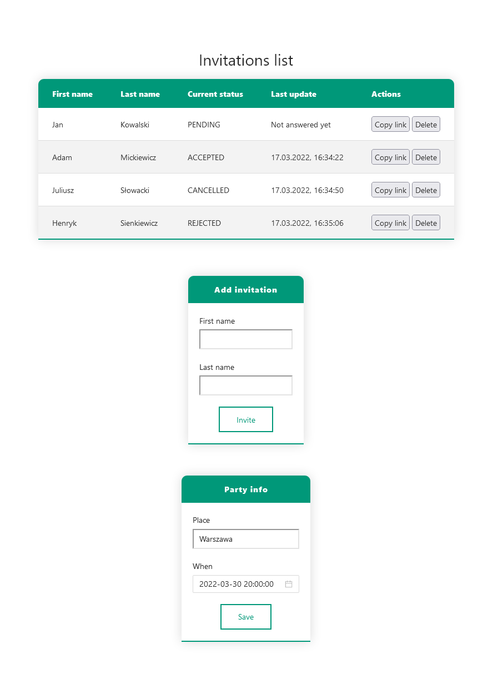
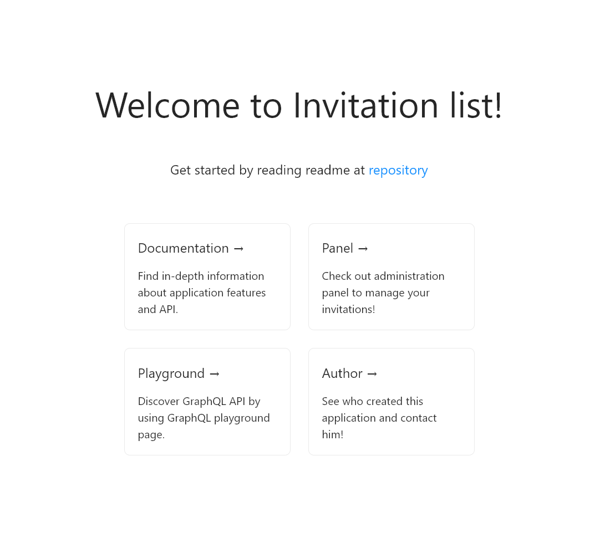
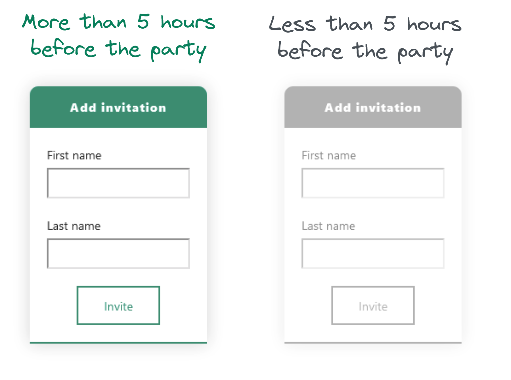
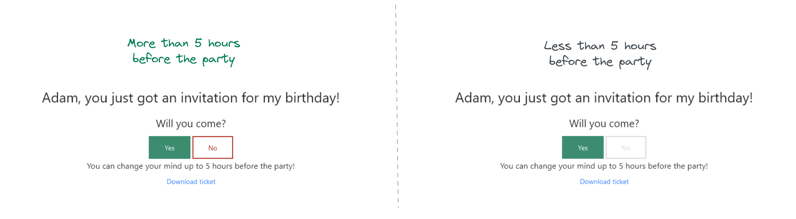

# Recruitment task for [Jutro Medical](https://jutromedical.com/) company



This repository contains solution for the recruitment [task](./docs/task.pdf).

Project consists of 5 services:

-   `proxy` - reverse proxy of `client` and `server` services
-   `client` - the Next.js application which serves simple frontend
-   `server` - the NestJS application which mainly serves `GraphQL` endpoint
-   `db` - the PostgreSQL database used by `server`
-   `pgadmin` - the PostgreSQL database administration tool

## How to run it?

Just run following command in the root directory of repository:

```bash
docker-compose -f "dev.docker-compose.yml" up --build
```

Docker should download necessary stuff from the hub, build the images and run the containers.

Proxy is configured to serve everything under [http://localhost](http://localhost), so make sure that your `80` port is free.

**You have to wait until the frontend is ready to accept requests.** It takes a while to install all necessary `npm` packages. So if you see `Bad gateway` error - just wait a bit and try again. You can also check the logs of the `client` container.

Then, when solution is running, you can open [http://localhost](http://localhost) in your browser. You will see following page:



You can click at any link and just discover everything.

## Backend

Backend uses `NestJS` framework and `Apollo GraphQL` for the `GraphQL` endpoint and playground. Connection to the database is solved with help of `TypeORM`.

In `server/src` directory you can find the following modules:

-   `invitations` - responsible for invitations management like handling `creation`, `deletion`, `acceptation`, `rejection` of invitation. This module also allows to fetch all invitations as well as fetch information about specific invitation using its `id`. In addition, this module allows to download the ticket in `HTML` format (for printing purposes) for person when he/she accepts invitation using separate endpoint.
-   `partyInfo` - this module allows to fetch or update information about information where and when the party will be held. It uses json file named `party.json` stored in the root of `cwd` to save and read information.

### Invitations model

I decided to create single table `invitations` in database. It contains minimum information about the invitations:

```typescript
enum InvitationStatus {
	PENDING = 1,
	ACCEPTED = 2,
	REJECTED = 3,
	CANCELLED = 4,
}

class Invitation {
	id: string;
	firstName: string;
	lastName: string;
	status: InvitationStatus;
	statusUpdateDate?: Date;
}
```

More information:

-   `id` is the primary key of the table
-   `statusUpdateDate` is nullable, because it is filled on first and every next update of `status` column
-   `status` has default value `PENDING`, which is changed later to `ACCEPTED`, `REJECTED` or `CANCELLED`

### PartyInfo model

`PartyInfo` model is just simple interface that is used to add typings to the `party.json` file.

```typescript
export class PartyInfo {
	where: string;
	when: Date;
}
```

It contains information about where and when the party will be held.

### Endpoints

Server has two endpoints:

-   `/api/graphql` - endpoint that servers `GraphQL` data or playground depending on request type
-   `/api/invitation/:id/ticket` - endpoint that serves `HTML` ticket file for given person, which is rendered from `server/views/ticket.hbs` handlebars template file

`GraphQL` schema looks following:

```graphql
type Invitation {
	id: ID!
	firstName: String!
	lastName: String!
	status: InvitationStatus!
	statusUpdateDate: DateTime
}

enum InvitationStatus {
	PENDING
	ACCEPTED
	REJECTED
	CANCELLED
}

scalar DateTime

type PartyInfo {
	where: String!
	when: DateTime!
}

type Query {
	invitations: [Invitation!]!
	invitation(id: String!): Invitation!
	isInvitationModificationLocked: Boolean!
	partyInfo: PartyInfo!
}

type Mutation {
	createInvitation(for: NewInvitationInput!): Invitation!
	acceptInvitation(id: String!): Invitation!
	rejectInvitation(id: String!): Invitation!
	deleteInvitation(id: String!): Invitation!
	savePartyInfo(info: PartyInfoInput!): PartyInfo!
}

input NewInvitationInput {
	firstName: String!
	lastName: String!
}

input PartyInfoInput {
	where: String!
	when: DateTime!
}
```

Latest and up to date schema file is generated when you run `dev.docker-compose.yml` file using `docker compose` and is available at `server/schema.gql` location.

## Frontend

Frontend is simple `Next.js` application. Communicates with backend using `Apollo GraphQL Client` library.

Applicaiton has three pages:

-   `/` - landing page
-   `/admin` - invitations and party info management page
-   `/invitation/:id` - this page allows to accept or reject invitation as well as download the ticket after acceptation

### Additionally:

You can change place and time of the party using `admin` page, which allows to quickly check the mechanics of locking the invitations modification and invitations creation 5 hours before the party:



The same behavior you can observe on invitation page:



## Why those technologies?

Why did I choose `GraphQL` and `React`? Because you are working using this technologies. In real life, for something as simple as this I would use standard REST API. I mean - `GraphQL` is great, but not for this size of project.

The rest of choices I made depending on my experience with given technologies, as I had to do this quickly.

I can answer more questions about specific decisions in an interview.

### Have a good day!
